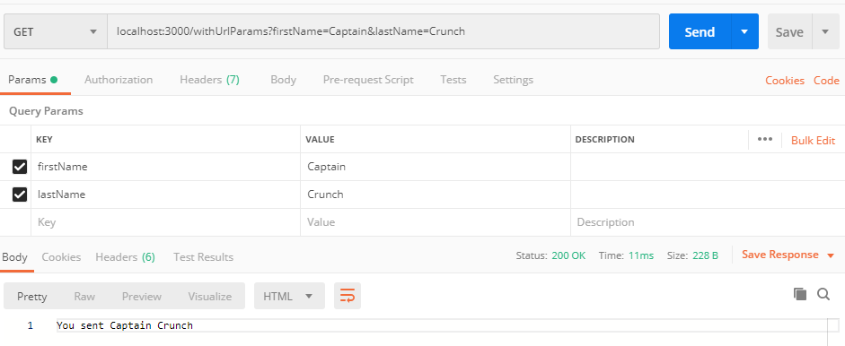
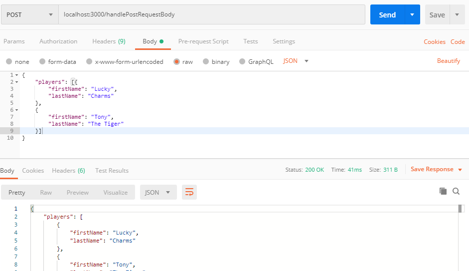

# Passing Data Between Client and Server

In the last example we showed how to get a response back from our express server from either a GET or a POST.  This time we'll look a bit deeper into how we can send data from the client to the server using either url parameters or a JSON request body.

This will also introduce the concept of express middleware. We'll need to use an additional component when we pass json parameters. 

## Query Parameters

Query parameters allow you pass data to the server using a GET.  In express, you can then pull the data passed into the route from the req.query object.  The withUrlParams route will echo back the firstName and lastName values you send in.

To test this you can pase the following into your browser:

http://localhost:3000/withUrlParams?firstName=Captain&lastName=Crunch

or you can send the request using Postman with the setup shown in the below image.



## JSON Request Body

If we want to pass some JSON in the request body we'll need to use an additional express middleware component called body-parser.

This is already part of the package.json file included here but if you needed to install it yourself you would run 

```
npm install --save body-parser
```

THis time you'll need to use Postman to send the request.  Make sure you're sending a POST to http://localhost:3000/handlePostRequestBody

On the Body tab choose raw and set the payload to be JSON.  The provide the following JSON in the request body.  When you send this request the server will just echo back the body.



## Other Useful Express Middleware

Cookie Parser to deal with parsing info from a cookie: https://www.npmjs.com/package/cookie-parser

Cors for dealing with cross orgin requests: https://www.npmjs.com/package/cors

